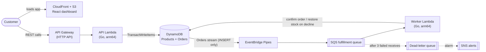

# FlashCart

**A serverless flash-sale checkout on AWS that holds 1,000 concurrent buyers to exactly the stock that exists: no overselling, and no duplicate orders from retries.**

[](https://github.com/rishon-g/flashcart/actions/workflows/deploy.yml)


https://github.com/user-attachments/assets/bf684da3-dfdd-4f52-a990-ea2e38d165f1

In a flash sale, thousands of buyers race for a few hundred units in a few seconds. A naive checkout oversells, double-charges people whose requests are retried, and loses orders when one step fails partway. FlashCart prevents all three with database-level guarantees, not application locks. It's built on AWS managed services, defined entirely in CDK, written in Go, and deployed by a tested CI pipeline.

## At a glance

| | |
| --- | --- |
| **Throughput** | ~6,920 requests/s averaged over a 20-second spike to 1,000 virtual users ([k6](#proving-it-works)) |
| **Latency** | 132 ms average, 194 ms p95, measured from the client |
| **Correctness** | 0 oversold units; a 500-goroutine race test proves exactly 100 of 500 buyers win 100 units |
| **Reliability** | Transactional outbox, compensating refunds, idempotent consumers, and a dead-letter queue with alerting |
| **Delivery** | One CDK stack; every push to `main` runs the tests, then deploys through keyless OIDC |

## Highlights

- **Oversell-proof by construction.** The stock decrement (`stock >= :qty`) and the order insert (`attribute_not_exists(orderId)`) commit in one DynamoDB `TransactWriteItems` call. Either both happen or neither does, however many requests race.
- **Idempotent end to end.** The client's `Idempotency-Key` is the order's primary key, so a retried request can't create a second order. Downstream, the worker only moves orders out of `PENDING`, so a message SQS delivers twice can't confirm or refund an order twice.
- **No dual writes.** The API writes only to DynamoDB. DynamoDB Streams and EventBridge Pipes deliver each new order to SQS with no glue code (the transactional outbox pattern).
- **Failure handled on purpose.** Declined payments trigger a compensating transaction that returns the unit to stock. Messages that keep failing go to a dead-letter queue, and a CloudWatch alarm sends an SNS notification.
- **Observable and secure by default.** Embedded Metric Format turns log lines into CloudWatch metrics with no extra API calls on the request path. CI deploys with short-lived OIDC credentials, and the admin endpoint is protected by a generated Secrets Manager token.

## Architecture



### How a purchase flows

1. **Reserve (synchronous).** `POST /orders` with an `Idempotency-Key` runs a single transaction: decrement stock if `stock >= 1`, and insert a `PENDING` order if that key is new. The API responds `201` for a new order, `200` for a replayed key, and `409` when sold out.
2. **Publish (asynchronous).** The order's `INSERT` appears on the table's stream. EventBridge Pipes filters out everything except inserts and forwards the order to SQS.
3. **Fulfill.** The worker simulates payment, declining 20% at random. An approved order becomes `CONFIRMED`. A declined order becomes `FAILED`, and in the same transaction its unit goes back on sale.
4. **Recover.** A failed write is reported as a batch item failure, so SQS retries only that message. After three receives, it goes to the dead-letter queue and the alarm fires.

## Key design decisions

| Problem | Decision | Why |
| --- | --- | --- |
| Overselling under concurrency | Conditional write inside a DynamoDB transaction | DynamoDB enforces the invariant atomically, so there are no locks, no read-then-write race, and nothing for Lambdas to coordinate. The cost is that transactional writes use twice the capacity of standard writes. |
| Duplicate orders on retries | Idempotency key as the primary key | Deduplication happens in the same transaction as the reservation, so it can't drift out of sync with stock. |
| Database and queue drifting apart | Transactional outbox with Streams and Pipes | If the API wrote to DynamoDB and SQS separately, a crash between the two writes would lose or orphan an order. With the stream as the single source of events, Pipes handles delivery with no consumer code to maintain. |
| Failed payments | Compensating transaction | Stock is restored atomically with the status change, so a declined order frees its unit without any manual cleanup. |
| At-least-once delivery from SQS | State-machine guard (`#s = :pending`) | Confirms and refunds are only valid from `PENDING`, so a redelivered message is acknowledged without doing anything. |
| Poison messages | `ReportBatchItemFailures` and a dead-letter queue | One bad message neither blocks its batch nor retries forever, and an alert fires as soon as anything lands in the dead-letter queue. |
| Metrics on the hot path | Embedded Metric Format | `SoldOutRejections`, `OrdersPlaced`, and `PaymentFailures` are emitted as structured logs, which costs no extra network calls. |
| Cost and cold starts | Go on `provided.al2023`, arm64, SDK clients created at startup | Small static binaries start fast, and Graviton (arm64) Lambdas cost less per GB-second than x86. |
| CI credentials | GitHub OIDC with a narrowly scoped role | The repo stores no long-lived AWS keys. The role trusts only this repo's `main` branch and workflow, and can only assume the CDK bootstrap roles. |

## Proving it works

| Layer | What it proves |
| --- | --- |
| **Concurrency test** ([`inventory_test.go`](backend/internal/inventory/inventory_test.go)) | 500 goroutines call `Reserve` simultaneously against 100 units on DynamoDB Local. Exactly 100 succeed, and final stock is `0`. |
| **Infrastructure tests** ([`infra.test.ts`](infra/test/infra.test.ts)) | Assertions on the synthesized CloudFormation template pin down the critical settings: table keys and stream, the `INSERT`-only filter, `maxReceiveCount: 3`, batch failure reporting, alarm wiring, and a deploy role that isn't an administrator. |
| **Load test** ([`script.js`](loadtest/script.js)) | k6 ramps to 1,000 virtual users with no think time. 10% of requests deliberately reuse an idempotency key to simulate client retries. Any response other than `201`, `200`, or `409` fails the check. |
| **Post-run audit** ([`verifier`](loadtest/verifier/main.go)) | The audit scans every order and checks `500 − CONFIRMED − PENDING = remaining stock`, non-negative stock, known statuses, and an empty dead-letter queue. It exits non-zero if any check fails. |
| **CI gate** ([`deploy.yml`](.github/workflows/deploy.yml)) | Go and CDK tests run against a DynamoDB Local service container on every push. Deploys happen only if they pass. |

### Load-test results

One 20-second spike (5 s ramp-up, 10 s hold at 1,000 virtual users, 5 s ramp-down), with simulated payment declines at 20%:

| Metric | Result |
| --- | --- |
| Throughput | ~6,920 requests/s (k6 `http_reqs`, averaged over the run) |
| Total requests | 145,000+ |
| Latency (client-side) | 132 ms average, 194 ms p95 |
| Orders created | 510: 418 confirmed, 85 declined (stock restored), 7 still pending |
| **Oversold units** | **0** (418 + 7 = 425 units claimed of 500) |

There are more than 500 orders because every declined order put its unit back on sale for another buyer. This run predates the current verifier, so the oversell figure comes from the reported counts rather than an automated `PASS` line.

## Hardening pass

A review comparing the code against its documentation turned up several edge cases. Each was fixed and covered:

- **Double refund on redelivery.** A redelivered "declined" message could restore the same unit twice, which is a latent oversell. Confirms and refunds are now conditional on `PENDING`.
- **Replay after sellout.** A retried request that arrived after the sale sold out returned `409`, although the order existed. The API now checks the idempotency condition first.
- **Silently dropped poison messages.** Unparseable messages were acknowledged and lost. They now go to the dead-letter queue.
- **Crash on read errors.** DynamoDB read errors caused nil-pointer panics. They now return `500` and are logged.
- **Unauthenticated admin endpoint.** Anyone with the URL could reset stock. The endpoint now requires a generated Secrets Manager token.
- **An audit that didn't check anything.** The verifier printed the invariant without evaluating it. It now evaluates every check and fails loudly.

## Tech stack

| Area | Technologies |
| --- | --- |
| Backend | Go, AWS Lambda (`provided.al2023`, arm64), API Gateway HTTP API, AWS SDK for Go v2 |
| Data and messaging | DynamoDB (transactions, Streams), EventBridge Pipes, SQS |
| Infrastructure and delivery | AWS CDK (TypeScript), GitHub Actions, IAM OIDC, Secrets Manager |
| Observability | CloudWatch dashboards and alarms, SNS, Embedded Metric Format, structured logging (`log/slog`) |
| Frontend | React 19, TypeScript, Vite, TanStack Query, Axios, served from S3 and CloudFront |
| Testing | Go `testing` with DynamoDB Local, Jest with CDK assertions, k6, custom Go auditor |

## What I'd build next

- **A real catalog.** Product ID and quantity come from the request instead of being fixed to one TV and one unit.
- **Run-scoped audits.** Tag orders with a sale ID, so restocks start a clean run and the verifier only counts that sale's orders.
- **Tighter deploy permissions.** Bootstrap CDK with a custom CloudFormation execution policy instead of the default `AdministratorAccess`.
- **CloudFront origin access control.** Migrate from the deprecated `S3Origin` to `S3BucketOrigin.withOriginAccessControl`.
- **Runtime config for the frontend.** Have the dashboard read the API URL at runtime, so a fresh deployment needs only one deploy.

---

<details>
<summary><b>API reference</b></summary>

All responses are JSON with CORS headers. The base URL is the `ApiUrl` stack output. Every endpoint returns `500` if DynamoDB returns an error.

| Method | Path | Description |
| --- | --- | --- |
| `GET` | `/products/{id}` | Returns `{"productId", "stock"}` (`stock` is a string), or `404`. The dashboard polls `/products/FLASH-TV-001` every second. |
| `POST` | `/orders` | Orders 1 unit of `FLASH-TV-001` (the body is ignored). Requires `Idempotency-Key`. Returns `201` for a new order, `200` for a replay (even when sold out), `400` if the header is missing, and `409` when sold out. |
| `GET` | `/orders/{id}` | Returns `{"orderId", "status"}` with status `PENDING`, `CONFIRMED`, or `FAILED`, or `404`. |
| `POST` | `/admin/products` | Requires `X-Admin-Token` (`401` otherwise). Sets `FLASH-TV-001` stock to 500 and returns `201`. Existing orders are kept. |

</details>

<details>
<summary><b>Getting started</b></summary>

**Prerequisites:** an AWS account with credentials configured, Go 1.27+, Node.js 20+, and (optionally) k6 and Docker.

CDK uploads the prebuilt `backend/cmd/*/bootstrap` binaries and `web/dist` as they are, so build them before you deploy:

```bash
# 1. Build both Lambdas for arm64 (from the repo root)
(cd backend/cmd/api    && GOOS=linux GOARCH=arm64 go build -tags lambda.norpc -o bootstrap main.go)
(cd backend/cmd/worker && GOOS=linux GOARCH=arm64 go build -tags lambda.norpc -o bootstrap main.go)

# 2. Build the dashboard
(cd web && npm ci && npm run build)

# 3. Deploy
cd infra
npm ci
npx cdk bootstrap   # first deploy to an account/region only
npx cdk deploy      # add -c alertEmail=you@example.com to get DLQ alarms by email
```

The deploy prints `ApiUrl`, `WebsiteUrl`, `AdminTokenSecretArn`, `AlarmTopicArn`, and `GitHubRoleArn`.

1. Set `API_URL` in [`web/src/App.tsx`](web/src/App.tsx) to your `ApiUrl`, rebuild the dashboard, and deploy again.
2. Fetch the admin token:
   ```bash
   aws secretsmanager get-secret-value --secret-id <AdminTokenSecretArn> --query SecretString --output text
   ```
3. Open `https://<WebsiteUrl>` (or run `npm run dev` in `web/`), paste the token into **Admin token**, and click **Reset warehouse** to load 500 units.

If you passed `alertEmail`, confirm the SNS subscription email from AWS.

**Deploying from a fork:** the stack creates a GitHub OIDC provider (this fails if your account already has one) and trusts only `rishon-g/flashcart`. Update the repository and `job_workflow_ref` conditions in `infra/lib/infra-stack.ts`, then set `role-to-assume` in `.github/workflows/deploy.yml` to your `GitHubRoleArn`.

### Running the tests

```bash
# Concurrency test (each run creates its own tables)
docker run --rm -d -p 8000:8000 amazon/dynamodb-local
(cd backend && go test ./... -v)

# CDK tests
(cd infra && npm test)

# Load test against a deployed stack (resets stock to 500 first)
k6 run -e API_URL=https://<api-id>.execute-api.<region>.amazonaws.com -e ADMIN_TOKEN=<token> loadtest/script.js

# Audit once the queue drains. Assumes the Orders table holds only this run's orders.
(cd loadtest/verifier && go run .)
```

</details>

<details>
<summary><b>Repository layout</b></summary>

```
backend/
  cmd/api/              API Lambda (router + handlers)
  cmd/worker/           SQS worker Lambda (payment simulation, compensation)
  internal/inventory/   Reserve transaction + concurrency test
infra/                  CDK app (InfraStack) + template assertions
web/                    React dashboard (Vite)
loadtest/
  script.js             k6 load test
  verifier/             Post-run invariant audit (Go)
.github/workflows/      deploy.yml: test, then OIDC deploy on push to main
```

</details>
