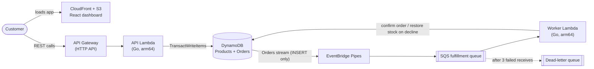

# FlashCart

**A serverless checkout backend for flash sales, built so a sale can't oversell and a retried request can't create a second order.**


https://github.com/user-attachments/assets/cd0d3ee8-b07c-4732-ad13-b512206da8d0

FlashCart is an event-driven backend built on AWS managed services and defined with AWS CDK. The business logic is in Go. It is designed for traffic spikes like a Black Friday drop, where thousands of buyers compete for a limited number of units of one product (`FLASH-TV-001`, 500 units).

**Load-test results at a glance** (one k6 run, 1,000 virtual users, 20 seconds; see [Load testing](#load-testing))

- **~6,920 requests per second** across 145,000+ requests
- **132 ms** average latency (p95: 194 ms), measured by the k6 client
- **0 oversold units**: 425 orders were sold or pending against 500 units of stock

## Architecture



Everything above is one CDK stack, `InfraStack`, in [`infra/lib/infra-stack.ts`](infra/lib/infra-stack.ts).

| Layer | Service | Role |
| --- | --- | --- |
| Frontend | S3 + CloudFront | Hosts the React/Vite dashboard (built from `web/dist`) over HTTPS |
| Synchronous API | API Gateway HTTP API + Go Lambda (1,024 MB) | A single `/{proxy+}` route sends every request to one Lambda, which routes by path and method |
| Database | DynamoDB (on-demand) | `Products` table keyed on `productId`; `Orders` table keyed on `orderId`, with a `NEW_IMAGE` stream |
| Outbox pipeline | DynamoDB Streams + EventBridge Pipes + SQS | The pipe filters the stream to `INSERT` events and forwards each new order to the fulfillment queue, one record at a time |
| Background worker | Go Lambda | Reads from SQS, confirms or refunds each order, and reports per-message failures back to SQS |
| Observability | CloudWatch + SNS | `FlashCart-Live-Metrics` dashboard, plus a dead-letter queue alarm that publishes to an SNS topic |
| Secrets | Secrets Manager | A generated admin token guards the restock endpoint |
| CI/CD | GitHub Actions + IAM OIDC | Tests, then builds and deploys, on every push to `main` |

### How a purchase flows

1. The customer clicks **Buy now**. The dashboard sends `POST /orders` with a random `Idempotency-Key` header.
2. The API Lambda runs one DynamoDB `TransactWriteItems` call with two operations. Either both succeed or neither does:
   - On `Products`: `SET stock = stock - :qty` with the condition `stock >= :qty`.
   - On `Orders`: `Put` an item with `orderId` set to the idempotency key and `status` set to `PENDING`, with the condition `attribute_not_exists(orderId)`.
3. If the order condition fails, the request is a replay, and the API returns `200` without touching stock, even after the sale has sold out. Otherwise, if the stock condition fails, the API returns `409 SOLD_OUT`.
4. The new order appears in the `Orders` stream as an `INSERT`. EventBridge Pipes forwards it to the SQS fulfillment queue. Status updates made later by the worker are `MODIFY` events, so the filter keeps them out of the queue.
5. The worker Lambda simulates payment, declining 20% of orders at random (`rand.Float32() < 0.20`). On success it sets the order to `CONFIRMED`. On a decline it runs a compensating transaction that sets the order to `FAILED` and adds the unit back to stock. Both writes require the order to still be `PENDING`, so if SQS delivers a message twice, the second delivery does nothing.
6. If a DynamoDB write fails, or a message can't be parsed, the worker reports that message as a batch item failure, and SQS redelivers it. After the third receive, SQS moves the message to the dead-letter queue, and the alarm fires.

## Engineering concepts

| Problem | Solution | How it works |
| --- | --- | --- |
| Overselling under concurrency | Conditional write inside a transaction | `stock >= :qty` lets DynamoDB reject any decrement that would take stock below zero. The decrement and the order insert commit together in one `TransactWriteItems` call. |
| Duplicate orders on retries | Idempotency key as the primary key | The client's `Idempotency-Key` becomes `orderId`. `attribute_not_exists(orderId)` cancels the whole transaction on a replay, so stock is decremented once per key. |
| Dual-write inconsistency | Transactional outbox | The API writes only to DynamoDB. The stream and the pipe deliver each new order to SQS, so the API never has to write to the database and the queue together. |
| Failed payments | Compensating transaction | The worker marks the order `FAILED` and runs `SET stock = stock + :qty` in a single transaction. |
| Duplicate SQS deliveries | Idempotent worker | Both the confirm and the refund carry the condition `#s = :pending`. A redelivered message fails that condition and is acknowledged, so a unit is never restored twice. |
| Partial batch failures | `ReportBatchItemFailures` | The worker returns only the failed message IDs, so SQS retries those messages and not the whole batch. |
| Poison messages | Dead-letter queue | `maxReceiveCount: 3` moves a message to `OrderDLQ` after its third failed receive. Malformed messages are reported as failures too, so they end up there rather than being dropped. A CloudWatch alarm notifies an SNS topic when the DLQ holds one or more messages. |
| Unauthorized restocks | Shared secret | `POST /admin/products` requires an `X-Admin-Token` header. The API compares it in constant time against a generated Secrets Manager value, which it reads once per cold start. |
| Blind spots in production | Embedded Metric Format | Both Lambdas print EMF JSON to stdout in the `FlashCart` namespace, so CloudWatch extracts metrics without extra API calls on the request path. The API emits `SoldOutRejections`. The worker emits `OrdersPlaced` (on confirmation) and `PaymentFailures`. |
| Cold-start overhead | Init outside the handler | The AWS SDK client is created once per execution environment, not once per request. |
| Credential leaks | OIDC deployments | GitHub Actions assumes an IAM role through OpenID Connect, so the repo stores no long-lived AWS access keys. The role trusts only `deploy.yml` on `refs/heads/main` of this repository. Its only permission is to assume the CDK bootstrap roles (`cdk-*`), which do the actual deploy. |

## API

All responses are JSON and carry CORS headers. Base URL: the `ApiUrl` stack output.

| Method | Path | Description |
| --- | --- | --- |
| `GET` | `/products/{id}` | Returns `{"productId", "stock"}` (`stock` is a string). Returns `404` if the product doesn't exist. The dashboard polls `/products/FLASH-TV-001` every second. |
| `POST` | `/orders` | Places an order for 1 unit of `FLASH-TV-001` (the request body is ignored). Requires an `Idempotency-Key` header. Returns `201` for a new order, `200` for a replayed key (even when sold out), `400` if the header is missing, and `409` when sold out. |
| `GET` | `/orders/{id}` | Returns `{"orderId", "status"}`, where `status` is `PENDING`, `CONFIRMED`, or `FAILED`. Returns `404` if the order doesn't exist. |
| `POST` | `/admin/products` | Requires an `X-Admin-Token` header (`401` otherwise). Overwrites `FLASH-TV-001` with `stock = 500` and returns `201`. Existing orders are left in place. |

Every endpoint returns `500` if DynamoDB returns an error.

## Load testing

[`loadtest/script.js`](loadtest/script.js) is a [k6](https://k6.io) script that simulates a flash-sale spike:

- **Setup:** calls `POST /admin/products` once, with the `ADMIN_TOKEN` environment variable, to seed 500 units. The test aborts if seeding fails.
- **Load profile:** ramps to 1,000 virtual users in 5 s, holds for 10 s, and ramps down over 5 s. There is no think time, so each VU sends requests back to back.
- **Retries:** 10% of requests reuse a per-VU idempotency key (`loadtest-order-<vu>`) to simulate network retries.
- **Check:** every response must be `201`, `200`, or `409`. Anything else, including a `500`, fails the check.

After the run, [`loadtest/verifier`](loadtest/verifier/main.go) scans every page of the `Orders` table, counts orders by status, reads the remaining stock and the DLQ depth, and checks these invariants:

- `500 − CONFIRMED − PENDING = remaining stock` (declined orders have returned their unit)
- Stock is not negative, and orders hold no more than 500 units
- Every order has a known status
- The dead-letter queue is empty

It prints `PASS` or `FAIL` for each check, and exits with `1` if any check fails. It finds the tables and the DLQ by name, so it needs no configuration beyond AWS credentials. It assumes the `Orders` table holds only orders placed since the last restock (see [Known limitations](#known-limitations)).

Results from one run, with simulated payment declines at 20%. This run predates the current verifier and the worker idempotency fix, so the oversell figure is derived from the reported counts rather than from a `PASS` line:

| Metric | Result |
| --- | --- |
| Virtual users | 1,000 |
| Throughput | ~6,920 requests/s (k6 `http_reqs` rate, averaged over the run) |
| Average latency | 132 ms (client-side `http_req_duration`) |
| p95 latency | 194 ms |
| Total requests | 145,000+ |
| Orders in the table | 510 |
| `CONFIRMED` | 418 |
| `FAILED` (declined, stock restored) | 85 |
| `PENDING` (not yet processed when audited) | 7 |
| **Oversold units** | **0** |

More than 500 orders exist because each declined order returns its unit to stock, where another buyer can claim it. Here, 418 + 7 = 425 units were claimed, which is within the 500 available.

## Testing

- **Concurrency test:** [`backend/internal/inventory/inventory_test.go`](backend/internal/inventory/inventory_test.go) seeds 100 units in [DynamoDB Local](https://docs.aws.amazon.com/amazondynamodb/latest/developerguide/DynamoDBLocal.html), launches 500 goroutines that call `Reserve` at the same time, and asserts that exactly 100 succeed and that the final stock is `0`.
- **Load test:** see [Load testing](#load-testing).
- **CDK tests:** [`infra/test/infra.test.ts`](infra/test/infra.test.ts) synthesizes the stack and asserts the table keys and stream, the `INSERT`-only pipe filter, `maxReceiveCount: 3`, partial batch failure reporting, the alarm's SNS action, the admin token wiring, and that the deploy role is not an administrator.
- **CI:** both suites run on every push. The deploy job runs only if they pass.

## Tech stack

| Area | Technologies |
| --- | --- |
| Backend | Go, AWS Lambda (`provided.al2023`, arm64), API Gateway HTTP API, AWS SDK for Go v2 |
| Data and messaging | DynamoDB, DynamoDB Streams, EventBridge Pipes, SQS |
| Security | IAM OIDC, Secrets Manager |
| Observability | CloudWatch dashboards and alarms, SNS, Embedded Metric Format, structured JSON logging (`log/slog`) |
| Infrastructure | AWS CDK (TypeScript), GitHub Actions with OIDC |
| Frontend | React 19, TypeScript, Vite, TanStack Query, Axios |
| Testing | Go `testing` against DynamoDB Local, Jest with CDK assertions, k6, custom Go verifier |

## Repository layout

```
backend/
  cmd/api/              API Lambda (router + handlers)
  cmd/worker/           SQS worker Lambda (payment simulation, compensation)
  internal/inventory/   Reserve transaction + concurrency test
infra/                  CDK app (InfraStack)
web/                    React dashboard (Vite)
loadtest/
  script.js             k6 load test
  verifier/             Post-test audit (Go)
.github/workflows/      deploy.yml (OIDC deploy on push to main)
```

## Getting started

**Prerequisites:** an AWS account with credentials configured, Go 1.27+, Node.js 20+, and (optionally) k6 and Docker.

The CDK stack packages prebuilt artifacts, so build the Lambdas and the frontend **before** you deploy. `cdk deploy` uploads `backend/cmd/*/bootstrap` and `web/dist` as they are.

```bash
# 1. Build both Lambdas for arm64 (run from the repo root)
(cd backend/cmd/api    && GOOS=linux GOARCH=arm64 go build -tags lambda.norpc -o bootstrap main.go)
(cd backend/cmd/worker && GOOS=linux GOARCH=arm64 go build -tags lambda.norpc -o bootstrap main.go)

# 2. Build the dashboard
(cd web && npm ci && npm run build)

# 3. Deploy the stack
cd infra
npm ci
npx cdk bootstrap   # first deploy to an account/region only
npx cdk deploy      # add -c alertEmail=you@example.com to get DLQ alarms by email
```

The deploy prints these outputs: `ApiUrl`, `WebsiteUrl` (the CloudFront domain), `AdminTokenSecretArn`, `AlarmTopicArn`, and `GitHubRoleArn`.

The API URL is hardcoded as `API_URL` in [`web/src/App.tsx`](web/src/App.tsx). On a new deployment, set it to your `ApiUrl`, rebuild the frontend (step 2), and run `npx cdk deploy` again.

To restock, fetch the admin token:

```bash
aws secretsmanager get-secret-value --secret-id <AdminTokenSecretArn> --query SecretString --output text
```

Open `https://<WebsiteUrl>` (or run `npm run dev` in `web/` for local development), paste the token into the **Admin token** field, and click **Reset warehouse** to load 500 units. The dashboard keeps the token only in page state and doesn't store it.

If you passed `alertEmail`, confirm the SNS subscription email that AWS sends you, or the alarm won't reach your inbox.

**Deploying from a fork:** the stack creates a GitHub OIDC provider (which fails if your account already has one) and trusts only `rishon-g/flashcart`. Change the repository and `job_workflow_ref` conditions in `infra-stack.ts`. Then put your `GitHubRoleArn` output into `role-to-assume` in `.github/workflows/deploy.yml`.

### Running the tests

```bash
# Concurrency test: needs DynamoDB Local on port 8000 (each run creates its own tables)
docker run --rm -d -p 8000:8000 amazon/dynamodb-local
(cd backend && go test ./... -v)

# CDK tests
(cd infra && npm test)

# Load test against a deployed stack (this resets stock to 500 first)
k6 run -e API_URL=https://<api-id>.execute-api.<region>.amazonaws.com -e ADMIN_TOKEN=<token> loadtest/script.js

# Audit the tables once the queue drains (uses your default AWS credentials and region)
(cd loadtest/verifier && go run .)
```

## CI/CD

[`.github/workflows/deploy.yml`](.github/workflows/deploy.yml) runs on every push to `main`, in two jobs:

1. **test:** runs `go vet` and `go test` against a DynamoDB Local service container, then runs the CDK Jest tests.
2. **deploy** (only if `test` passes): assumes the deploy role through OIDC in `us-east-1`, builds both Go Lambdas and the React app, and runs `cdk deploy --require-approval never`.

Both jobs read the Go version from `backend/go.mod`.

## Known limitations

- **Single product, single unit.** The product ID and quantity are hardcoded in the API (`FLASH-TV-001`, qty 1).
- **Restocking doesn't clear orders.** `POST /admin/products` resets only the stock. The verifier's stock equation assumes the `Orders` table holds only orders placed since the last restock, so it will report `FAIL` after a second run unless you clear the table first (or redeploy).
- **Deploys still run with broad permissions.** The GitHub role can only assume the CDK bootstrap roles, but by default the CloudFormation execution role that those roles use has `AdministratorAccess`. Pass `--cloudformation-execution-policies` to `cdk bootstrap` to narrow it.
- **The CloudFront origin uses a deprecated API.** `S3Origin` (origin access identity) still works, but CDK recommends `S3BucketOrigin.withOriginAccessControl`.
- **The frontend's API URL is hardcoded,** so each new deployment needs a rebuild and a second deploy.
