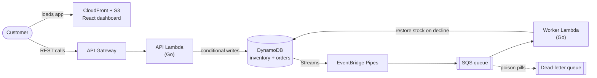

# FlashCart

**A serverless checkout backend for flash sales that never oversells and never double-charges.**


https://github.com/user-attachments/assets/cd0d3ee8-b07c-4732-ad13-b512206da8d0

FlashCart is an event-driven backend built entirely on AWS managed services, defined with AWS CDK, with business logic in strictly typed Go. It is designed for traffic spikes like a Black Friday drop, where thousands of buyers compete for a limited number of units.

**Load-test results at a glance**

- **6,920 requests per second** at peak, with 1,000 concurrent users
- **132 ms** average API latency (p95: 194 ms)
- **0 oversold units** and **0 duplicate charges**, verified by a post-test audit of the database

## Architecture



| Layer | Service | Role |
| --- | --- | --- |
| Frontend | S3 + CloudFront | Hosts the React/Vite dashboard and serves it globally |
| Synchronous API | API Gateway + Go Lambda | Accepts orders and reports live inventory |
| Database | DynamoDB | Stores inventory and orders |
| Outbox pipeline | DynamoDB Streams + EventBridge Pipes + SQS | Delivers every new order to fulfillment without the API touching the queue |
| Background worker | Go Lambda | Processes payments, compensates on failure, and sends poison pills to the DLQ |

### How a purchase flows

1. The customer clicks **Buy now**. The dashboard sends `POST /orders` with an `Idempotency-Key` header.
2. The API Lambda decrements stock with a conditional write (`stock >= :qty`) and records the order, guarded by `attribute_not_exists(orderId)`. If stock is gone, the API returns `409`.
3. DynamoDB Streams captures the new order. EventBridge Pipes forwards it to the SQS fulfillment queue.
4. The worker Lambda pulls the message and processes the (simulated) payment.
5. If the payment is declined, a compensating transaction returns the unit to inventory. Messages that keep failing land in the dead-letter queue.

## Engineering concepts

| Problem | Solution | How it works |
| --- | --- | --- |
| Overselling under concurrency | Optimistic locking | DynamoDB conditional writes (`stock >= :qty`) reject any order that would take stock below zero |
| Double charges on retries | Idempotency | `attribute_not_exists(orderId)` ensures a retried request cannot create a second order |
| Dual-write inconsistency | Transactional outbox | The API writes only to DynamoDB. Streams and Pipes guarantee delivery to SQS, so the database and queue cannot drift apart |
| Failed payments | Compensating transaction | The worker restores the item to inventory when a payment declines |
| Poison messages | Dead-letter queue | Messages that repeatedly fail are isolated instead of blocking the queue |
| Blind spots in production | Embedded Metric Format | Orders Placed, Payment Failures, and Sold Out Rejections are emitted as structured logs, so custom CloudWatch graphs need no extra API calls on the request path |
| Credential leaks | OIDC deployments | GitHub Actions authenticates to AWS through OpenID Connect, so no long-lived IAM access keys exist |

## API

| Method | Path | Description |
| --- | --- | --- |
| `GET` | `/products/{id}` | Returns the current stock for a product, for example `FLASH-TV-001`. The dashboard polls it every second. |
| `POST` | `/orders` | Places an order. Requires an `Idempotency-Key` header, and repeating a request with the same key will not create a second order. Returns `409` when sold out. |
| `POST` | `/admin/products` | Restocks inventory to 500 units of `FLASH-TV-001`. |

## Load testing

I load-tested the API with [k6](https://k6.io), simulating a flash-sale spike of 1,000 concurrent users. Lambda memory was tuned upward because it also scales CPU, which brought latency down under load.

| Metric | Result |
| --- | --- |
| Concurrent users | 1,000 |
| Peak throughput | 6,920 requests/s |
| Average latency | 132 ms |
| p95 latency | 194 ms |
| Total requests | 145,000+ |
| Unique orders processed | 510 |
| Successful orders | 418 |
| Declined payments (inventory restored) | 85 |
| **Oversold units** | **0** |
| **Duplicate charges** | **0** |

A custom Go auditing script checked the database invariants after the run, confirming that inventory and orders matched exactly.

## Tech stack

| Area | Technologies |
| --- | --- |
| Backend | Go, AWS Lambda, API Gateway |
| Data and messaging | DynamoDB, DynamoDB Streams, EventBridge Pipes, SQS |
| Infrastructure | AWS CDK (TypeScript), GitHub Actions |
| Frontend | React, TypeScript, Vite, TanStack Query, Axios |
| Testing | k6, custom Go audit script |

## Getting started

**Prerequisites:** an AWS account with credentials configured, Node.js, Go, and the AWS CDK CLI.

```bash
# 1. Deploy the infrastructure (run from the CDK app directory)
npm install
npx cdk bootstrap   # first deploy only
npx cdk deploy

# 2. Run the dashboard locally (run from the frontend directory)
npm install
npm run dev
```

Then set `API_URL` in `App.tsx` to the API Gateway URL printed by the deploy, open the dashboard, and click **Reset warehouse** to load 500 units.
